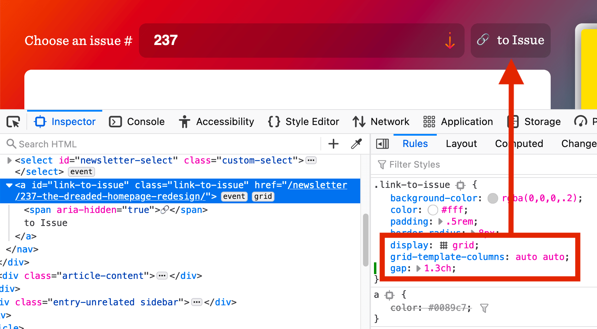
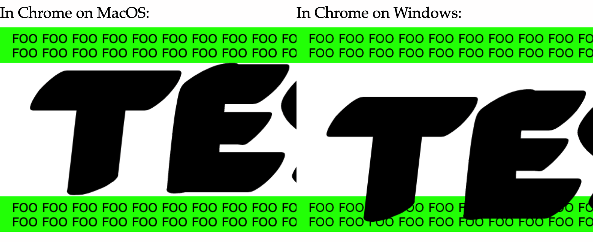

# CSS `::-webkit-autofill` has become a standard feature

Chrome, Safari, and pretty much every other modern web browser except Firefox (more on that later) have supported the [CSS `:-webkit-autofill` pseudo-class](https://developer.mozilla.org/en-US/docs/Web/CSS/:-webkit-autofill) for many years. This selector matches form fields that have been autofilled by the browser. Websites can use this feature to style autofilled fields in CSS ([with some limitations](https://developer.mozilla.org/en-US/docs/Web/CSS/:autofill)) and detect such fields in JavaScript.

```js
let autofilled = document.querySelectorAll(":-webkit-autofill");
```

<video src="media/css-autofill-counter.mp4" controls width="603" height="286"></video>

**Note:** There currently does not exist a standard `autocomplete` or `autofill` event that would fire when the browser autofills a form field, but you can [listen to the `input` event](https://paul.kinlan.me/detecting-when-autofill-happens/) on the web form and then check if any of its fields match the `:-webkit-autofill` selector.

The HTML Standard has now [standardized](https://github.com/whatwg/html/issues/6181) this feature by adding `:autofill` (and `:-webkit-autofill` as an alias) to the [list of pseudo-classes](https://html.spec.whatwg.org/multipage/semantics-other.html#pseudo-classes) that match HTML elements. This pseudo-class will also be [added](https://github.com/w3c/csswg-drafts/issues/5775) to the CSS Selectors module.

> The `:autofill` and `:-webkit-autofill` pseudo-classes must match `<input>` elements that have been autofilled by the user agent. These pseudo-classes must stop matching if the user edits the autofilled field.

Following standardization, both pseudo-classes have been [implemented](https://bugzilla.mozilla.org/show_bug.cgi?id=1685675) in Firefox and are expected to ship in Firefox 86 later this month.

# You can use CSS Grid to define spacing in buttons and links

In the article “[Let’s Bring Spacer GIFs Back!](https://www.joshwcomeau.com/react/modern-spacer-gif/)” Josh W. Comeau argues for using a “spacer” `<span>` element instead of a simple CSS margin to define the spacing between the icon and text of a button component.

> In our home-button example, should the margin go on the back-arrow, or the text? It doesn’t feel to me like either element should “own” the space. It’s a distinct layout concern.

CSS Grid is an alternative to such spacer elements. For example, the “Link to issue” link in CSS-Tricks’s [newsletter section](https://css-tricks.com/newsletters/) contains two non-breaking spaces (`&nbsp;`) to increase the spacing between the emoji character and text, but the link could instead be turned into a simple grid layout to gain finer control over the spacing via the `gap` property.

<figure>
  
</figure>

# Websites agree that the pointer cursor is not just for links

The CSS Basic User Interface module defines the [CSS `cursor` property](https://drafts.csswg.org/css-ui-4/#cursor), which allows websites to change the type of cursor that is displayed when the user hovers specific elements. The specification has the following to say about the property’s `pointer` value:

> <mark>The cursor is a pointer that indicates a link.</mark> … User agents must apply `cursor: pointer` to hyperlinks. … Authors should use `pointer` on links and may use on other interactive elements.

Accordingly, browsers display the `pointer` cursor (rendered as a hand) on links and the `default` cursor (rendered as an arrow) on buttons. However, most websites (incl. Wikipedia) don’t agree with this default style and apply `cursor: pointer` to other interactive elements, such as buttons and checkboxes, as well.

Another interactive element for which it [makes sense](https://css-tricks.com/two-issues-styling-the-details-element-and-how-to-solve-them/) to use the `pointer` cursor is the `<summary>` element (the “toggle button” for opening and closing the parent `<details>` element).

https://codepen.io/hellogreg/pen/MWyvxOb

# Browsers delay `autoplay` until the video comes into view

Compared to modern video formats, animated GIF images are up to “[twice as expensive in energy use](https://webkit.org/blog/6784/new-video-policies-for-ios/).” Browsers have for that reason relaxed their video autoplay policies (some time ago) to encourage websites to switch from GIFs to silent or muted videos.

```html
<!-- a basic re-implementation of a GIF using <video> -->
<video autoplay loop muted playsinline src="meme.mp4"></video>
```

If you’re using `<video muted autoplay>`, don’t worry about pausing such videos when they’re no longer visible in the viewport (e.g., using an [Intersection Observer](https://css-tricks.com/a-few-functional-uses-for-intersection-observer-to-know-when-an-element-is-in-view/)). All major browsers ([except Firefox](https://bugzilla.mozilla.org/show_bug.cgi?id=1386280)) already perform this [optimization](https://webkit.org/blog/6784/new-video-policies-for-ios/) by default:

> `<video autoplay>` elements will only begin playing when visible on-screen such as when they are scrolled into the viewport, made visible through CSS, and inserted into the DOM.

https://codepen.io/simevidas/full/yLVVNaK

([via Zach Leatherman](https://twitter.com/zachleat/status/1349788433879871488))

# Chrome introduces three new `@font-face` descriptors

Different browsers and operating systems sometimes use [different font metrics](https://github.com/w3c/csswg-drafts/issues/4792) even when rendering the same font. These differences affect the vertical position of text, which is especially [noticeable on large headings](https://tobireif.com/posts/ensuring_the_correct_vertical_position_of_large_text/).

<figure>
    
</figure>

Similarly, the different font metrics of a web font and its fallback font can cause a layout shift when the fonts are swapped during page load.

To help websites avoid layout shift and create interoperable text layouts, Chrome recently [added](https://www.chromestatus.com/feature/5651198621253632) the following three new CSS `@font-face` descriptors for overriding the font’s [default metrics](https://drafts.csswg.org/css-inline-3/#ascent-descent):

- `ascent-override` (ascent is the height above the baseline)
- `descent-override` (descent is the depth below the baseline)
- `line-gap-override`

```css
@font-face {
  font-family: Roboto;
  /* Merriweather Sans has 125.875px ascent 
   * and 35px descent at 128px font size.
   */
  ascent-override: calc(125.875 / 128 * 100%);
  descent-override: calc(35 / 128 * 100%);
  src: local(Roboto-Regular);
}
```

The following video shows how overriding the ascent and descent metrics of the fallback font (Roboto) to match the same metrics of the web font (Merriweather Sans) can avoid layout shift when swapping between these two fonts.

https://www.youtube.com/watch?v=h_0T3SiISZg
